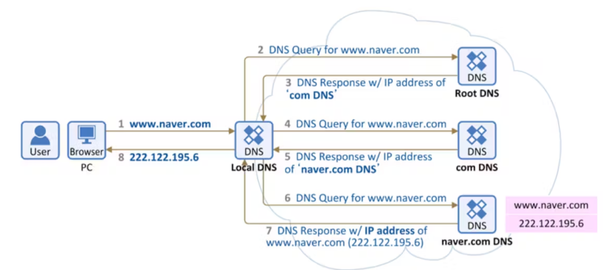
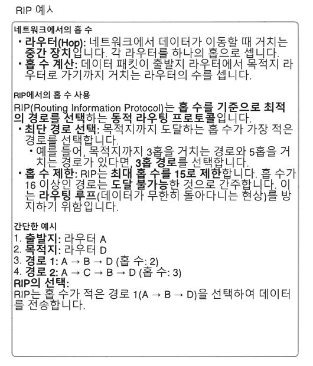

# 오늘의 성과

<span style = "color:white; font-size:90%">오늘은 어제 했던 redis를 사용하는 방법을 찾아 보도록 하자. 
</span>

### redis-clound

<span style = "color:white; font-size:90%">현재 node.js에서 redis에서 사용하려고 하면 redis와 관련된 모듈이 필요하다. <br>
redis 자체를 사용하기 위한 것도 필요하지만 cloud 연결을 위한 별도의 모듈 또한 필요하다.
</span>

```js
npm install redis
npm install -g redis-cli
```

연결을 하기 위해선 다음과 같이 코드를 작성하면 된다.<br>

```js
import redis from 'redis'
import dotenv from 'dotenv'
import express from 'express'

dotenv.config();

const redisClient = redis.createClient({
    url: `redis://default:${process.env.PASSWORD}@${process.env.ENDPOINT}:${process.env.PORTNUMBER}/0`,
    legacyMode: true // 반드시 설정?
});

redisClient.on('connect', ()=> {
    console.info('Redis Connected');
})

redisClient.on('error', (err) => {
    console.error('redis error', err);
})

redisClient.connect().then();//redis v4 비동기 연결
const redisCli = redisClient.v4;//v4는 프로미스 기반이다.

//set을 사용해서 create, update가 가능하다.
//await redisCli.set('test1', "잘 들어감2");
//get을 통해서 read가 가능하다.
let data = await redisCli.get('test1');
//del을 통해 delete 가능
// await redisCli.del('test1');
// await redisCli.del('item_unlock');
//console.log(data);
```


# 면접 준비를 해보자.

취업을 위해선 기술 면접이라는 것을 결국 보게 될 텐데 나는 면접을 잘 못한다. 그렇기에 기술 면접에 들어가서 물어 볼 법한 질문들을 정리라도 하여 대비해 보도록 하자.<br>

## 질문 1 : IP란 무엇이며 IP의 종류, 서브넷에 대해 설명하시오

IP란 서버와 클라이언트 간에 통신을 하기 위한 규칙, 즉 통신 규약을 의미하며 좁은 의미로는 이 통신을 할 때 쓰이는 ip주소를 의미한다. 현재 사용되는 IP의 종류로는 IPv4와 IPv6가 있으며 일반저으론 IPv4를 많이 보게 된다.<br>

|종류|기능|
|---|---|
|IPv4|32bit(4byte)짜리 주소로, 현재 사람들이 접하게 되는 대부분의 주소는 여기에 해당한다. (255.55.231.123) 이런 느낌으로 표현된다면 여기다.|
|IPv6|위의 것의 최대 사용 가능자 숫자가 약 43억명 정도이며, 현재는 그 이상의 사람이 존재하기 때문에 새로운 주소 체계가 필요하다 하여 만들어진 것으로, 128bit의 주소 체계를 가진다.|

사용의 측면에선 공인 IP(인터넷 네트워크 내부에서 사용되는 중요 ip)와 사설 IP(사설 네트워크에서 사용할 수 있는 ip)로 나뉘게 된다.<br> 

## 질문 2 : 브라우저 등에 도메인 주소를 입력했을 때 이뤄지는 절차에 대해 설명하시오

먼저 입력 받은 dns 주소를 parse하여 주소 등을 얻어내야 한다(dns 요청). dns 서버의 캐시에 등록이 되어 있다면 빠르게 연결이 가능하지만 없다면 dns 서버 측에서 해당 도메인을 찾는다. 찾아낸 ip 주소를 기반으로 네이버 서버와 TCP 통신을 한다. (3 way handshake). 이 때 어떤 방법으로 통신을 하는지, 보안 프로토콜 등을 확인한 다음에, 전부 확인이 된다면 현재 접속하려는 dns 측의 서버에서 적합한 데이터를 렌더링해준다. 브라우저라고 했으니까 보통은 html 등을 보여줄 것이다. 현재 하는 프로젝트에서 하나의 컴퓨터에서 서버를 열고 그걸 localhost라고 하는 dns 주소를 받아 서버가 index.html을 띄우는 방식으로 이어진다. <br>

절차 요약<br><br>

브라우저 주소 창에 주소 입력(http, https) => 입력 받은 데이터를 url 파싱하여 프로토콜, 도메인, 경로 등을 구분함 => DNS 조회(캐시에 있으면 빨리 되고 없으면 DNS 서버에 요청하여 탐색 후 캐시 등록) => 웹 서버 처리 => 브라우저 랜더링(서버 쪽에서 받은 데이터에 맞는 소스(html 파일 등)를 클라이언트의 화면에 송출한다.)

=> 수정<br>

dns가 어떻게 IP를 찾는가.<br>



local DNS에서 알고 있다면 찾도록 하고, 모르면 root DNS(DNS서버들의 제일 위 쪽) 보낸 다음 점차 전문적으로 구분 짓는다.(com, 프로토콜, 서브 도메인 등), 루트에서 시작해 각 단계 별로 원하는 구분 짓고 다음 자식 노드 쪽으로 가는 것으로 보건데 BFS 방식으로 연결되고 있는 것으로 탐색하는 모양이다. 좀 더 전문적인 알고리즘이 있을 것으로 보이나 기본적으로 해당 방식으로 연결한다고 답하면 좋을 듯 하다.<br>

## 질문 3 : 라우터, 라우팅에 대해, 정적, 동적 라우팅에 대해 설명하시오

네트워크에 데이터를 오가는 시간도 다 돈이고, 뭣보다 사용자가 불편하기 때문에 가능하면 싸고 빠르게 전송을 해주어야 한다. 라우팅은 그런 식으로 최단 경로를 찾도록 도와주는 기능이며, 라우터는 그런 라우팅을 하는 도구이다.<br>

정적 라우팅은 라우팅 테이블을 네트워크 관리자가 직접 작성하는 것으로, 네트워크 중간에 경로가 변경되지 않는다면 별도의 연산이 필요하지 않아 동적 라우팅에 비해 간편하나, 연결이 많아질 수록 네트워크 관리자의 할 일이 많아지고 한 번 연결이 끊어지면 관리자가 다시 연결을 시켜주어야만 가능하다.<br>

그에 반해 동적 라우팅은 프로토콜(rip, ospf,bgp 등)을 사용하여 라우팅 테이블을 작성한다.<br>

연결 방식을 질문할 경우에는 RIP을 먼저 언급해 보도록 하자.<br>

